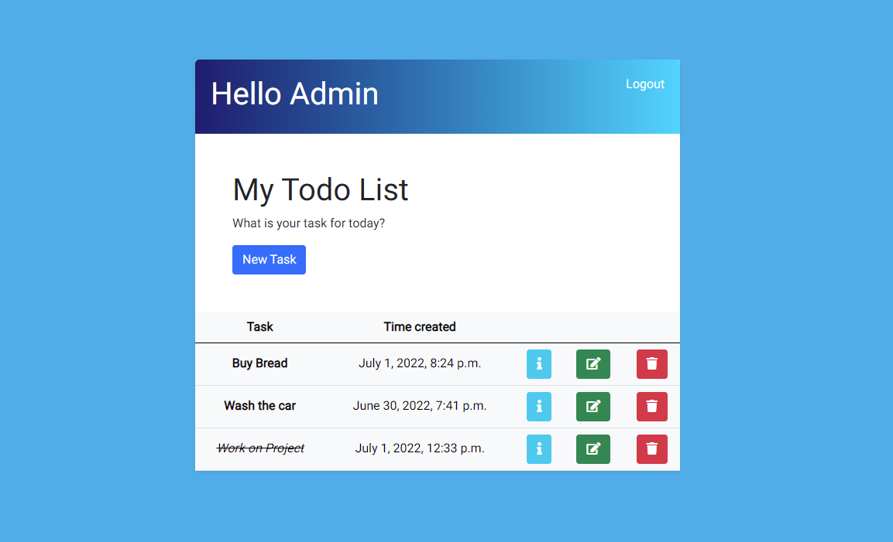

# Todo App

## Overview

### About
* Todo App is a website application designed to help users stay focused and be more organized.

# User Experience

## Project goals

* Goal of the project was to show my competency in being able to create a web app using the Django Framework. App needed to be simple enough for someone who also works full time in addition of studying, but still fully learn and implement the CRUD process.

* The users of the site will be able to register and login on the page. Once they do that they will be able to create their own task lists, read the details, update them and delete.