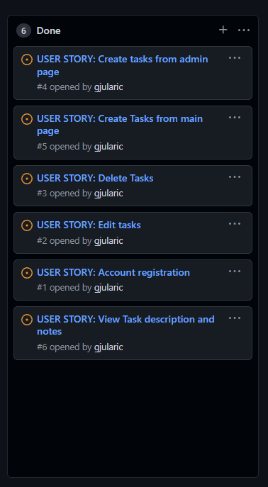

# Todo App

# Overview

### About
* Todo App is a website application designed to help users stay focused and be more organized.

* The live deployed application can be found here [TodoApp](https://mytoodo-app.herokuapp.com/)

# User Experience

## Project goals

* Goal of the project was to show my competency in being able to create a web app using the Django Framework. App needed to be simple enough for someone like me who also works full time in addition of studying, but to still fully learn and implement the CRUD process.

* The users of the site will be able to register and login on the page. Once they do that they will be able to create their own task lists, read the details, update them and delete.

## Agile

## User Stories

### Create Tasks as Admin

* As a Site Admin I can create tasks

### Account registration

* As a Site User I can register an account so that I can add my own tasks

### Create Tasks as User

* As a Site User I can create the tasks on my main page

### View task description

* As a Site User I can view task description and notes

### Edit tasks

* As a Site User I can update my own tasks

### Delete Tasks

* As a Site User I can delete my own tasks.

# Features

* The first release includes:
    - A login page to allow users to have their own todo lists.
    - A register page for new users.
    - users can log in and add tasks and setup their todo list.
    - Once logged in a user can update or delete their tasks.
    - Authentication used to determine who is logged and who can create/update or delete.
    - users can log out at any time.

### Login page

* User can open the webpage from the URL provided and will be asked to log in. If they dont have an account there is a "Sign Up" button which will lead them to register page.

### Register page

* If user doesn't have sign in details already they can register here

### Todo List Page

* The site user can create their own todo list here or select options to view, update and delete the list items.

### Create/Update page

* The site user can create or update their tasks through this form

### Task Details

* The site user can view their task info on this page

### Task Details

* The site user can confirm deleting the task through this message

## Database model and wireframe

* Todo List data model

* Wireframe

# Technology-Used-In-Design

* Django framework
* HTML5
* CSS3
* Python
    - Used in conjunction with the Django framework to implement the website.
* Heroku
    - Use to deploy the project on to the live site.

* [Django](https://docs.djangoproject.com/en/4.0/)
    - Used to create the URLS, Views, Forms and models in the site.
* [Bootstrap](https://getbootstrap.com/)
    - Bootstrap is mainly used to style the page and add responsiveness to the website.
* [Cloudinary](https://cloudinary.com/)
    - Cloudinary is used to store the static files.
* [Google Fonts](https://fonts.google.com/)
    - Main Fonts for the project
* [Gitpod](https://www.gitpod.io)
    - Gitpod is used to write the code
* [Github](https://github.com/)
    - Github is being used to store the repository.
* [Font Awesome](https://fontawesome.com/)
    - Font awesome is used for the info, update, delete icons.
* [PostGres](https://www.postgresql.org/download/)
    - Database used through heroku.
* [SQLite](https://django-allauth.readthedocs.io/en/latest/)
    - https://www.sqlite.com/index.html
* [Balsamiq](https://django-allauth.readthedocs.io/en/latest/)
    - To create the wireframes.

## Requirements file

* asgiref==3.5.2
* cloudinary==1.25.0
* dj-database-url==0.5.0
* dj3-cloudinary-storage==0.0.5
* Django==3.2.13
* gunicorn==20.1.0
* psycopg2==2.9.3
* pytz==2022.1
* sqlparse==0.4.2

# Testing (Manual)

## I have tested the full CRUD functionality on the project.

### Users can:

- create tasks by clicking "New Task".
- update task by clicking on green edit icon.
- delete the tas by clicking on the red trash icon.
- view the details of the task and notes.
- login and register to see or set up their own list.

### HTML Validator

### CSS-Validator

## PEP8

### All PEP8 validations

### Views.py

### Urls.py

### Models.py

### Lighthouse Scores

# Deployment

### Gitpod and GitHub

Used the [Code Institute Full Template](https://github.com/Code-Institute-Org/gitpod-full-template) to set up the gitpod workspace.

### Steps:

* Click create new repository.
* Give the repository a name.
* Under Repository template pick the [Code Institute Full Template](https://github.com/Code-Institute-Org/gitpod-full-template).
* Click create repository
- Use GIT ADD .
- GIT COMMIT -m "Comments"
- GIT PUSH
- To commit the code and push to Github

## Forking the Github Repository

- Locate the desired Github repository.
- In the top right corner click the Fork button.
- The repository has been forked and you can now work on the copy.

## Cloning a Github repository

- Locate the desired Github repository.
- Use the code button and copy the link.
- Open Gitpod and select your directory where you want the clone to be created.
- Type git clone in the terminal and paste the link in.
- The clone will be created

### Creating and Deploying Application with Heroku

I used the "I Think Therefore I Blog" tutorial provided by The Code Institute to deploy the application on Heroku.

- Log in to Heroku [Heroku](https://dashboard.heroku.com/)
- Click New 
- Give the app a name and choose the region
- Click on settings first and set the Reveal Config Vars
- Click Deploy at the top to go to the Deployment settings
- Choose GiHub as the deployment method
- Search for your app and connect
- Use Automatic deploys if you would like a new build when changes are pushed to GitHub from Gitpod
- Use Manual deploy for a new build every time this button is clicked.
- Once completed click View App

# Credits
- "Hello Django" and "I Think Therefore Blog" tutorials from Code Institute to get direction, set up the environment, and deploy to Heroku
- https://ccbv.co.uk/projects/Django/4.0/ for views
- https://docs.djangoproject.com/en/4.0/ always handy django documentation
- Slack community (got a bit of direction how to fix static files not being recognized by Heroku)
- StackOwerflow
- Balsamiq for wireframe

# Issues/Bugs

### Static files were not loading when deployed on Heroku

Fix:
* Updated requirements.txt file manually with "cloudinary==1.25.0", "dj3-cloudinary-storage==0.0.5"

### Small bugs with positioning of the pages
* it's due to project not having enough styling at the moment