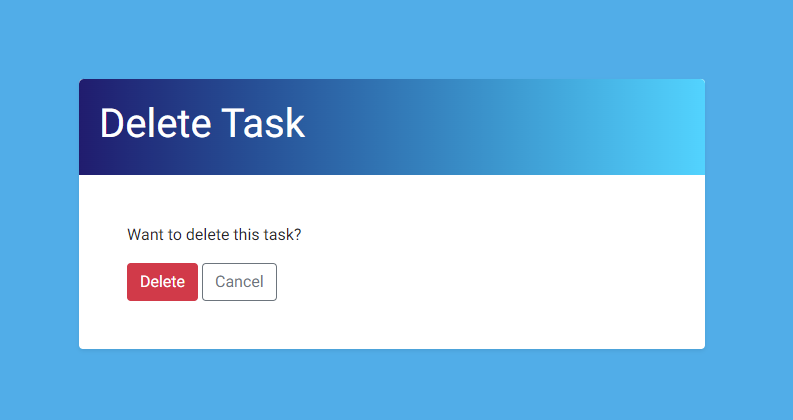

# Todo App

# Overview

### About
* Todo App is a website application designed to help users stay focused and be more organized.

* The live deployed application can be found here [TodoApp](https://mytoodo-app.herokuapp.com/)

# User Experience

## Project goals

* Goal of the project was to show my competency in being able to create a web app using the Django Framework. App needed to be simple enough for someone who also works full time in addition of studying, but still fully learn and implement the CRUD process.

* The users of the site will be able to register and login on the page. Once they do that they will be able to create their own task lists, read the details, update them and delete.

## Agile

## User Stories

### Create Tasks as Admin

* As a Site Admin I can create tasks

### Account registration

* As a Site User I can register an account so that I can add my own tasks

### Create Tasks as User

* As a Site User I can create the tasks on my main page

### View task description

* As a Site User I can view task description and notes

### Edit tasks

* As a Site User I can update my own tasks

### Delete Tasks

* As a Site User I can delete my own tasks.

# Features

* The first release includes:
    - A login page to allow users to have their own todo lists.
    - A register page for new users.
    - users can log in and add tasks and setup their todo list.
    - Once logged in a user can update or delete their tasks.
    - Authentication used to determine who is logged and who can create/update or delete.
    - users can log out at any time.

### Login page

* User can open the webpage from the URL provided and will be asked to log in. If they dont have an account there is a "Sign Up" button which will lead them to register page.

### Register page

* If user doesn't have sign in details already they can register here

### Todo List Page

* The site user can create their own todo list here or select options to view, update and delete teh list items.

### Create/Update page

* The site user can create or update their tasks through this form

### Task Details

* The site user can view their task info on this page

### Task Details

* The site user can confirm deleting the task through this message